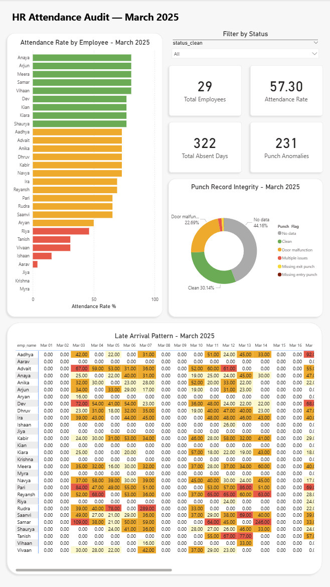
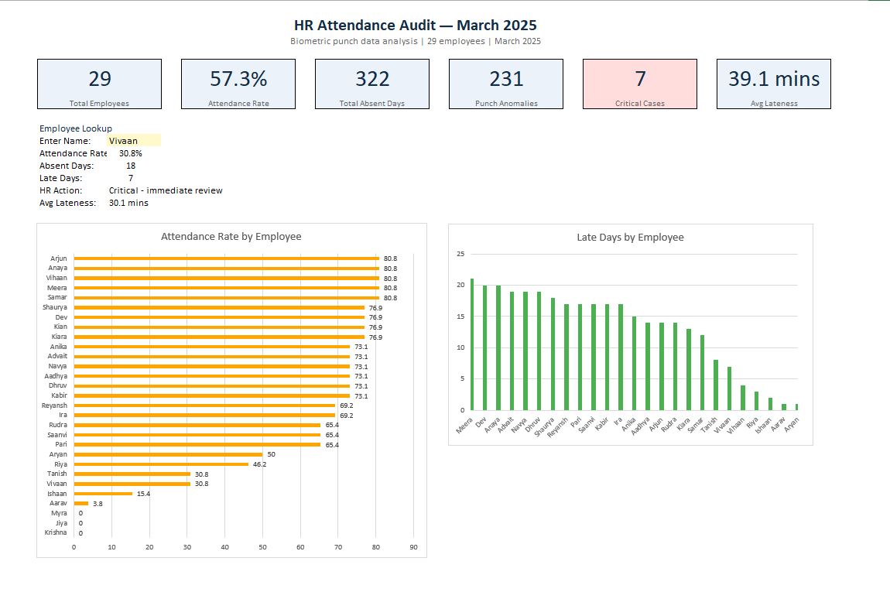

# hris-audit-dashboard
End-to-end HR analytics project simulating real-world biometric punch data auditing, attendance compliance reporting, and
payroll anomaly detection for a 29-employee development center — built to mirror the daily workflows of an HRIS analyst role.

***

## Project Overview
A startup installed a basic biometric punch machine to monitor employee attendance. The raw punch data contained documented
inconsistencies — door malfunctions causing duplicate punches, missing entry and exit records, and employees tailgating
without recording their access. This project cleans, audits, and visualizes that data across four tools to produce actionable
HR reports.

***

## Tools & Technologies
| Tool | Purpose |
|---|---|
| Python (pandas, re) | Data cleaning, punch record parsing, audit export |
| SQL Server (SSMS) | Database storage, 5 audit queries |
| Power BI | Executive-level interactive dashboard |
| Excel (XLOOKUP, SUMIF, Pivot Tables) | HR manager audit workbook |
| Jupyter Notebook | Documented analytical workflow |

***

## Power BI Dashboard

Four visuals with a status slicer that filters all visuals simultaneously:
 
- **Summary cards** — Total Employees, Attendance Rate, Total Absent Days, Punch Anomalies
- **Attendance rate bar chart** — all 29 employees color coded green/orange/red by threshold
- **Punch integrity donut chart** — breakdown of all 6 punch flag categories
- **Late arrival heatmap matrix** — 29 employees × 31 days with color coded lateness severity

## Excel Audit Workbook

The `HR_Audit_Report.xlsx` workbook contains 6 sheets:
 
| Sheet | Contents |
|---|---|
| Dashboard | Summary metrics, XLOOKUP employee lookup tool, pivot charts |
| Late Arrivals | Query 1 results — formatted with conditional formatting |
| Absenteeism | Query 2 results — attendance rate per employee |
| Overtime | Query 3 results — OT hours breakdown |
| Punch Integrity | Query 4 results — flag category percentages |
| HR Action Required | Query 5 results — color coded action labels |
 
**XLOOKUP employee lookup tool** — type any employee name to instantly retrieve their attendance rate, absent days, late days,
HR action status, and average lateness across sheets.
 
**Formulas used:** XLOOKUP, IFERROR, COUNTIF, SUMIF, COUNTA, AVERAGE, ROUND, cross-sheet referencing, pivot tables,
conditional formatting

***

## Key Findings
 
**Attendance**
- Overall attendance rate: 57.3% across 29 employees in March 2025
- 3 employees — Jiya, Krishna, Myra — recorded 0% attendance, absent all 26 working days
- 7 employees flagged Critical requiring immediate HR review
- Aarav attended only 1 day out of 31 (3.8% attendance rate)
  
**Lateness**
- 76% of present days had at least one late arrival
- Meera was late on 21 of 21 present days — 100% late rate
- Rudra's single worst lateness: 289 minutes (nearly 5 hours)
- Samar averaged 63 minutes late per late day
- Advait accumulated 19 total late days with 4 classified as Severe
  
**Overtime**
- Dev accumulated 56.38 overtime hours in March — equivalent to 7 extra full workdays
- Top 6 overtime employees each exceeded 48 overtime hours in a single month
- Vihaan and Riya showed suspiciously high per-day overtime averages (9+ hours) flagged for review
   
**Punch Integrity**
- Only 30.1% of all 899 records were clean punch sequences
- 204 records flagged for door malfunction — hardware maintenance recommended
- 27 records required manual HR intervention (missing exit, missing entry, multiple issues)
- 44.2% of records had no punch data — expected for absent and weekly off days
  
**HR Action Summary**
- Critical — immediate review: 7 employees
- High — manager follow-up: 2 employees
- Moderate — coaching needed: 6 employees
- Monitor: 14 employees
- No employee had a fully clean attendance record in March 2025

***
# Workflow Phases
***

## Repository Structure
 
```
hr-attendance-audit/
│
├── data/
│   ├── Attendance_data_raw.csv          # Original Kaggle dataset
│   └── Attendance_data_clean.xlsx       # Cleaned export for SSMS
│
├── notebooks/
│   └── 01_cleaning_and_audit.ipynb      # Full documented cleaning pipeline
│
├── sql/
│   ├── 01_late_arrival_summary.sql
│   ├── 02_absenteeism_report.sql
│   ├── 03_overtime_summary.sql
│   ├── 04_punch_integrity_audit.sql
│   └── 05_chronic_attendance_hr_action.sql
│
├── excel/
│   └── HR_Audit_Report.xlsx             # 6-sheet formatted audit workbook
│
├── powerbi/
│   ├── dashboard_overview.png
│   ├── attendance_chart.png
│   ├── punch_integrity.png
│   └── lateness_heatmap.png
│
└── README.md
```

***

## Workflow
 
```
Raw biometric punch CSV
        ↓
Python — clean data, parse valid punches, flag anomalies
        ↓
SQL Server — 5 audit queries across attendance, lateness, OT, punch integrity
        ↓
Python — connect to SSMS via pyodbc, generate formatted Excel audit report
        ↓
Excel — XLOOKUP dashboard, pivot charts, conditional formatting
        ↓
Power BI — interactive executive dashboard with slicer filtering
```

***

## Data Cleaning Highlights
 
The raw dataset contained several documented real-world integrity issues:
 
**Punch record parsing**
The biometric system recorded both valid punches `(IN)` `(OUT)` and invalid noise from door malfunctions. A custom Python regex parser extracted only valid punch sequences and validated them against expected IN/OUT alternation logic:
 
```python
def parse_valid_punches(raw):
    if pd.isna(raw):
        return []
    matches = re.findall(r'(\d{1,2}:\d{2}):[^(]*\((\w+)\)', str(raw))
    return [(time, direction) for time, direction in matches
            if direction in ('IN', 'OUT')]
 
def simplify_flag(raw):
    punches = parse_valid_punches(raw)
    if not punches: return 'No data'
    directions = [p[1] for p in punches]
    has_consec = any(directions[i]==directions[i+1] for i in range(len(directions)-1))
    has_missing_out = directions[-1] != 'OUT'
    has_missing_in = directions[0] != 'IN'
    if (has_consec and has_missing_out) or (has_consec and has_missing_in):
        return 'Multiple issues'
    if has_missing_out: return 'Missing exit punch'
    if has_missing_in: return 'Missing entry punch'
    if has_consec: return 'Door malfunction'
    return 'Clean'
```
 
**Issues identified and resolved:**
- Trailing whitespace in `Status` column causing silent filter failures
- Date strings requiring datetime conversion for trend analysis
- Time columns stored as `HH:MM` strings converted to timedelta for duration math
- `0:00` values (on-time employees) incorrectly treated as null — fixed by returning `pd.Timedelta(0)` explicitly
- `_mins` columns exported as `nvarchar` due to timedelta serialization — resolved by casting to `float` before export

***

## SQL Audit Queries
 
Five queries written for the `hr_audit` database in SQL Server:
 
**Query 1 — Late arrival summary**
Ranks all employees by late days with severity breakdown (Severe/Moderate/Minor)
 
**Query 2 — Absenteeism report**
Calculates attendance rate per employee using `NULLIF` to avoid division by zero
 
**Query 3 — Overtime summary**
Aggregates total, average, and peak OT hours per employee
 
**Query 4 — Punch integrity audit**
Groups all 899 records by punch flag category with percentage of total
 
**Query 5 — Chronic attendance issues**
Uses nested `CASE` logic to assign HR action labels — Critical, High, Moderate, Monitor — based on absence count and severe lateness frequency

***

## Data Source
 
Dataset: [Real Time Punch Data to Record Attendance](https://www.kaggle.com/datasets/nileshnandants/real-time-punch-data-to-record-attendance) — Kaggle
 
Anonymized synthetic dataset created for educational purposes. Scenario: startup development center with a basic biometric punch system containing documented real-world inconsistencies including door malfunctions, tailgating, and missing punch records.
 
***
 
## About This Project
 
Built as part of a portfolio targeting HR Systems Analyst and People Analytics roles. The project was designed to demonstrate end-to-end HRIS data workflows — from raw biometric data through cleaning, auditing, and reporting — using the same tools and processes used in enterprise HR environments.
 
**Skills demonstrated:** Python data cleaning, SQL Server querying, pyodbc database connectivity, Excel XLOOKUP and pivot tables, Power BI dashboard design, HR data domain knowledge, punch record integrity auditing, attendance compliance reporting.
 
